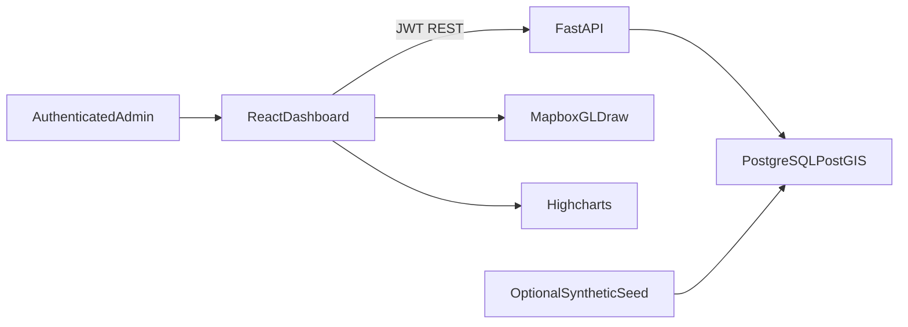

# Darukaa.Earth

Map-first carbon and biodiversity intelligence for landscape restoration programs. Administrators create projects, draw real Mapbox polygons, record field observations, and inspect performance over time.

This is a geospatial analytics workspace, not a sustainability marketing site. Identity comes from the map, the numbers, and a Swiss/editorial layout: warm off-white ground, forest green, sage, and lime used only for positive movement.

## High-level architecture

```
React (Vite)  --JWT-->  FastAPI
     |                      |
 Mapbox GL JS          SQLAlchemy 2
 Mapbox Draw           GeoAlchemy2
 Highcharts                 |
     |                      |
     +------ PostGIS / PostgreSQL ------+
```

- The SPA owns interaction: login, global map, project and site lifecycle, observation entry, and analytics filters.
- The API owns identity (JWT), persistence, GeoJSON validation, PostGIS area, and derived Project Health scores.
- PostGIS stores site polygons (`GEOMETRY(Polygon, 4326)`). Area is always `ST_Area(geom::geography) / 10000`.
- Alembic is the schema source of truth. The API process does not call `create_all` at startup.

Every screen reads from the API. Login issues a JWT. The map renders GeoJSON from `GET /api/sites`. Create and edit flows POST/PATCH exact GeoJSON. Satellite tiles appear when `VITE_MAPBOX_TOKEN` starts with `pk.`; drawing still has a GeoJSON coordinate fallback if tiles fail.



## Why this dataset

`python -m app.seed` loads fictional but geographically plausible restorations (Amazon, Sundarbans, Congo Basin, Mau Forest, Borneo peatland, Sierra meadows) so Mapbox has global spread and Highcharts has 2022–2026 series without a paid satellite vendor.

The seed is optional and uses the same tables as live CRUD. Administrators can replace every seeded project, site, and observation through the UI. The frontend never hardcodes project IDs, KPIs, or demo credentials.

## Database schema

| Table | Purpose |
| --- | --- |
| `users` | Administrators (unique email, bcrypt hash) |
| `projects` | Landscape with country, status, carbon target, `created_by` |
| `sites` | Named polygon + stored `area_ha` (PostGIS-computed) |
| `metric_observations` | Dated carbon tCO₂e, biodiversity 0–100, restoration 0–100 per site |

Project Health is not stored. The API computes it as carbon-vs-target (40%), latest biodiversity (30%), and restoration progress (30%). Site health uses the same weights against a per-site share of the project carbon target.

Alembic `0001` enables PostGIS and creates tables. `0002` makes delete cascades explicit: deleting a project removes sites and observations; deleting a user who still owns projects is restricted.

## Local setup

Runtimes: Node 22 (`.nvmrc`), Python 3.12 (`.python-version`).

### 1. Database

```bash
docker compose up -d
```

Postgres/PostGIS listens on **15432**. First boot creates `darukaa`, `darukaa_test`, and the PostGIS extension on both.

Without Docker:

```bash
sudo apt-get install -y postgresql-16 postgresql-16-postgis-3
sudo pg_ctlcluster 16 main start
sudo -u postgres psql -c "CREATE ROLE darukaa LOGIN PASSWORD 'darukaa' SUPERUSER;"
sudo -u postgres psql -c "CREATE DATABASE darukaa OWNER darukaa;"
sudo -u postgres psql -c "CREATE DATABASE darukaa_test OWNER darukaa;"
sudo -u postgres psql -d darukaa -c "CREATE EXTENSION IF NOT EXISTS postgis;"
sudo -u postgres psql -d darukaa_test -c "CREATE EXTENSION IF NOT EXISTS postgis;"
```

### 2. Environment

```bash
cp .env.example .env
```

Set `JWT_SECRET` (≥32 random characters for production) and `VITE_MAPBOX_TOKEN`. Copy Vite keys into `frontend/.env` as well:

```bash
cp frontend/.env.example frontend/.env
```

### 3. API

```bash
cd backend
python3 -m venv .venv
source .venv/bin/activate   # Windows: .venv\Scripts\Activate.ps1
pip install -e ".[dev]"
alembic upgrade head
python -m app.seed          # optional demo portfolio
uvicorn app.main:app --host 0.0.0.0 --port 18765
```

Health: `GET http://localhost:18765/health`  
Readiness (database ping): `GET http://localhost:18765/ready`

Optional seed login: `admin@darukaa.earth` / `darukaa-demo`. The login form is blank; type those credentials if you seeded.

### 4. Web app

```bash
cd frontend
npm install
npm run dev
```

Vite serves **http://localhost:41782**.

Root `npm install` once so Husky pre-commit hooks install.

## Code quality

Husky runs lint-staged on every commit:

- Prettier, then Oxlint `--fix`, on staged frontend files
- `python -m ruff check --fix` and `python -m ruff format` on staged Python (no silent skip)

Manual checks from the repo root (Windows-safe; uses `python -m`):

```bash
npm run lint
npm run format:check
npm run test:frontend
npm run build
python -m pytest backend
```

`npm test` at the root also runs pytest and needs PostGIS on `TEST_DATABASE_URL`.

## CI/CD

[`.github/workflows/ci.yml`](.github/workflows/ci.yml) runs on pull requests and pushes to `main`.

1. **frontend** — Node 22, `npm ci`, Prettier check, Oxlint, Vitest, production TypeScript build.
2. **backend** — Python 3.12, Ruff format/check, Alembic against a PostGIS service container, pytest, Docker image build.
3. **deploy** (`main` push only) — If secrets exist:
   - `RENDER_DEPLOY_HOOK` deploys the FastAPI service in [`render.yaml`](render.yaml).
   - Vercel CLI deploys `frontend/`.
   - Optional `POSTDEPLOY_API_URL` / `POSTDEPLOY_FRONTEND_URL` smoke-check `/health` and `/`.

The Render Blueprint only defines the API web service (`plan: free`). Provision Postgres with PostGIS yourself (Neon works), then set `DATABASE_URL` and `CORS_ORIGINS` in the Render dashboard. Paste the URI from Neon’s dashboard; the API rewrites `postgres://` to `postgresql+psycopg://` and adds `sslmode=require`. If the password contains `@`, `#`, or `%`, URL-encode it. Neon needs the PostGIS extension enabled. `ENVIRONMENT=production` is already in `render.yaml`. Seed production separately if you want demo rows.

### Required GitHub secrets

| Secret | Used for |
| --- | --- |
| `RENDER_DEPLOY_HOOK` | Render deploy of `darukaa-api` |
| `VERCEL_TOKEN` | Vercel CLI |
| `VERCEL_ORG_ID` | Vercel project |
| `VERCEL_PROJECT_ID` | Vercel project |
| `VITE_API_URL` | Public Render API URL ending in `/api` |
| `VITE_MAPBOX_TOKEN` | Public Mapbox token used by the production build |
| `POSTDEPLOY_API_URL` | Optional API origin for smoke tests (no `/api` suffix) |
| `POSTDEPLOY_FRONTEND_URL` | Optional Vercel origin for smoke tests |

Until those secrets are present, CI still gates quality; deploy steps no-op.

Feature-by-feature evidence for evaluators: [HACKATHON_REPORT.md](HACKATHON_REPORT.md).

## API surface

| Method | Path | Notes |
| --- | --- | --- |
| GET | `/health`, `/api/health` | Process liveness |
| GET | `/ready`, `/api/ready` | Database ping |
| POST | `/api/auth/register` | JWT + user |
| POST | `/api/auth/login` | JWT + user |
| GET | `/api/auth/me` | Current user |
| GET | `/api/projects` | Aggregated KPIs |
| POST | `/api/projects` | GeoJSON Polygon sites |
| GET | `/api/projects/{id}` | Includes time series |
| PATCH | `/api/projects/{id}` | Name, country, status, target |
| DELETE | `/api/projects/{id}` | Cascades sites and observations |
| GET | `/api/analytics/portfolio` | Live portfolio totals |
| GET | `/api/sites` | FeatureCollection for the map |
| POST | `/api/projects/{id}/sites` | Add a site |
| GET | `/api/sites/{id}` | Site analytics + observation ids |
| PATCH | `/api/sites/{id}` | Name/geometry; area recomputed |
| DELETE | `/api/sites/{id}` | Cascades observations |
| POST | `/api/sites/{id}/observations` | New dated metrics |
| PATCH | `/api/observations/{id}` | Update a measurement |
| DELETE | `/api/observations/{id}` | Remove a measurement |

Authenticated administrators share one portfolio by design (challenge: administrator viewing all projects).

## Trade-offs

- **JWT in `localStorage`** keeps the SPA deployable on Vercel without a shared cookie domain. XSS is the cost; HTTP-only cookies would be better behind one origin.
- **Highcharts** is denser for this demo; Chart.js is the fully open-source alternative and must be licensed correctly for commercial use.
- **Open registration** is for evaluation. Production should add invitations, rate limits, and password recovery.
- **Shared-admin visibility** matches the brief. Multi-tenant production needs organizations and row-level authorization.
- **Optional synthetic seed** is documented, not a runtime mock. Mapbox public tokens should be URL-restricted in the Mapbox dashboard.

## Product map

1. Overview — live map, KPIs from current projects  
2. Projects — create, edit, delete landscapes; add named sites  
3. Sites — Mapbox Draw polygons, edit boundaries, record observations  
4. Analytics — Highcharts for carbon, biodiversity, restoration; portfolio filters  
5. Settings — live `/health` and `/ready` (database reachable)  
